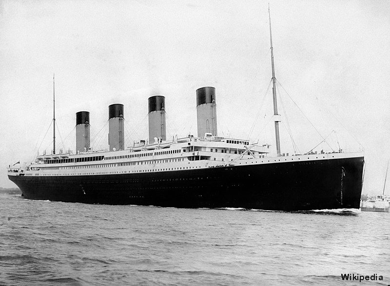

# Titanic Survival Prediction

## Project goals
- Conduct a statistical analysis to determine how certain groups had higher survival rates.
- Perform an exploratory data analysis (EDA) of the Titanic dataset, incorporating visualizations and storytelling.
- Apply supervised machine learning methods using PySpark to predict passenger survival and identify the most accurate model.

## Data location
Kaggle

## Installation
To run this notebook interactively:
- Download this repository in a zip file by clicking on this [link](https://github.com/dinhlang86/Titanic.git/archive/refs/heads/main.zip) or execute this from the terminal: git clone https://github.com/dinhlang86/Titanic.git

## Dependencies
- [numpy](https://numpy.org/)
- [pandas](http://pandas.pydata.org/)
- [sklearn](http://scikit-learn.org/stable/)
- [matplotlib](http://matplotlib.org/)
- [seaborn](https://seaborn.pydata.org/)
- [pyspark](https://spark.apache.org/docs/latest/api/python/index.html)
- [squarify](https://python-charts.com/part-whole/treemap-matplotlib/)

## Conclusion

### Exploratory Data Analysis:
- Observations Summary:
    - The training dataset contains 891 observation.
    - There are 177 missing values in Age column, 687 in Cabin column, 2 in Embarked colulmn.
    - The testing dataset contains 418 observation.
    - There are 86 missing values in Age column, 327 in Cabin column, 1 in Fare colulmn.
- Exploratory Feature Summary:
    - Class 3 had the highest number of passengers and mortality rate; Class 1 had the highest survival rate.
    - Passengers traveling with 1-3 parents/children had higher survival chances, while traveling alone or with many family members reduced survival rates.
    - Higher fares were strongly associated with increased survival rates.
    - Children under 10 and adults aged 21-30 had higher survival rates; survival significantly decreased for those over 60.
    - Females had significantly higher survival rates than males, particularly those aged 11-40.
    - Passengers embarking from Cherbourg had the highest survival rates, while most passengers boarded at Southampton.

### Predictive Models:
- Data Processing:
    - Remove Cabin feature due to a lot of missing values.
    - Create Title column based on Name column and modify the misspelling for this column.
    - Replace the missing values in Age colum with the average age of each Title category.
    - Replace missing values in the Embarked column with the most frequent value (S) in the training dataset.
    - Replace missing values in the Fare column with the average value of Pclass=3, Sex=male, and Embarked=S in the testing dataset.

- Models Comparision:
    -   Logistic Regression Model has the highest accuracy at 0.834 following by Gradient Boosted Classifier Model and Random Forest Classifier Model. 
    -   Logistic Regression Model and Gradient Boosted Classifier Model have the lowest False Postive values at 10 cases where the Models incorrectly predict the chance of survival. 
    -   However, Logistic Regression Model has the highest number of True Positive where the Model correctly predicts the chance of survival.
    -   As a result, Logistic Regression Model is the best model to predict the chance of survival for Titanic dataset. When applied to the testing dataset, this model predicted that 148 passengers survived and 270 did not survive.

## Contributing
Rosa Pham

